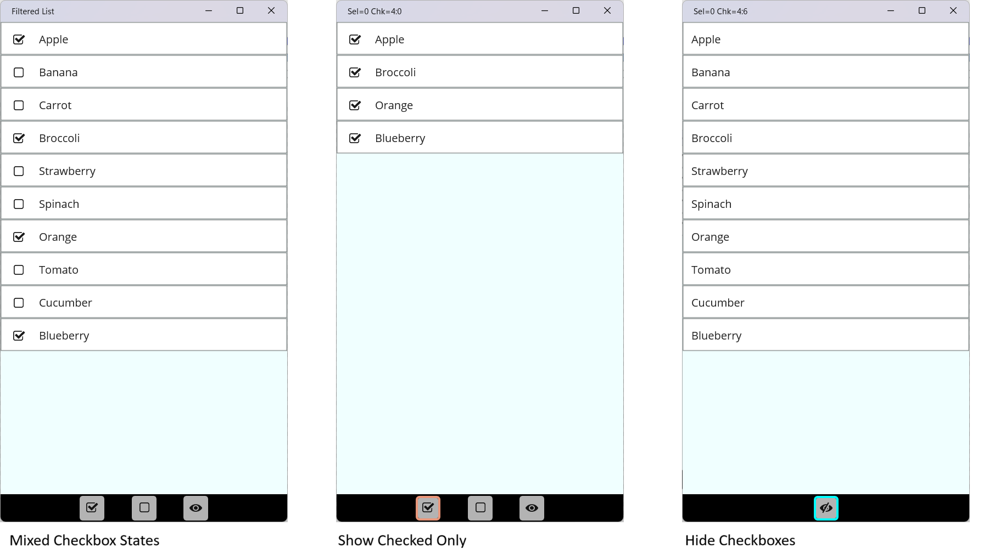
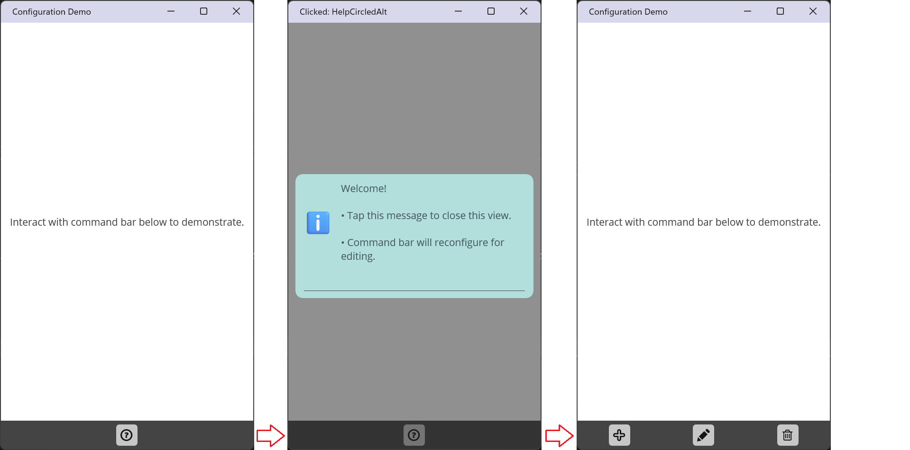

# [<](../../README.md)

# Demos

This repo contains eval projects that were originally created in the course of internal testing, made presentable as much as resources allow. The demos rely on advanced features of `ObservablePreviewCollection`:

| # | Feature | Description |
|---|------------------|---------------------|
| 1 | [Track Contexts](https://github.com/IVSoftware/IVSoftware.Portable.Collections/blob/master/IVSoftware.Portable.Collections/README/opc-advanced.md#subset-tracking) | Maintain item subsets based on matching property changes where predicates are declared using the `[Track]` attribute. |
| 2 | [List Filtering](https://github.com/IVSoftware/IVSoftware.Portable.Collections/blob/master/IVSoftware.Portable.Collections/README/opc-advanced.md#list-filtering) | Display a reversible subset of the list. |
| 3 | [Markdown Context](https://github.com/IVSoftware/IVSoftware.Portable.Collections/blob/master/IVSoftware.Portable.Collections/README/opc-advanced.md#filtering-using-sqlite-markdown) | Filter using simplified and intuitive text expressions with operators like `&`, `!`, `|` and parentheses.

Buttons and command bars with buttons feature icons that are shown using `IVSoftware.GlyphProvider`

| # | Feature | Description |
|---|------------------|---------------------|
| 1 | [Glyph Provider](https://github.com/IVSoftware/IVSoftware.GlyphProvider/blob/master/README.md) | Glyphs are indexed by enum members, and the enum type carries the font family information |
| 2 | [Configurable Stacks](#configurationintro.maui.demo) | Any named `enum` can be used to configure command stacks and menus with icons by mapping its members to `[Glyph]` enumerations present in the `GlyphProvider`|


The salient points of each are summarized below.
___

# FilteredList.Maui.Demo



This example displays a standard `CollectionView` where `ItemsSource` is `ObservablePreviewCollection<T>` and `<T>` inherits from `IVSoftware.Portable.SQLiteMarkdown.Common.SelectableQFModel`. This base type is used here because it already supplies the canonical `IsChecked`, `Selection`, and `[PrimaryKey]` surface that `ObservablePreviewCollection` relies on when tracking and filtering are enabled.

Two core concepts, **Track Contexts** and **Filtering**, are leveraged in the demo: TrackContexts drive shaded visual selection states (e.g. Single or Multiple selection), while filtering enables reversible subsets such as “Checked Items Only” or its inverse.

Although tracking and filtering are often used together, they operate on different axes:

- **TrackContexts** observe how items change over time. They maintain live, incremental subsets based on tracked property transitions and never affect item visibility.
- **Filtering** determines which items are visible. Filters are expressed as reversible WHERE clauses evaluated against an immutable snapshot of the list.
  - **MarkdownContext** provides a stateful, text-driven surface for composing simplified queries using IME input.
  - **Predicate filters** are enum-backed toggles or selections that participate in the same filtering pipeline.

TrackContexts remain active regardless of filtering state, while filters alter only the visible surface and can always be removed to restore the original list.

___

### Markdown Context

The `MarkdownContext` provides the declarative filtering surface for the demo, translating user-facing filter intent into predicate expressions without mutating the underlying collection. This demo introduces it incrementally by utilizing the `ObservablePreviewCollection.MarkdownContext` property strictly in `Filter` mode. 

This matters here because `Filter` mode conveys the expectation of an immutable underlying recordset. So, when the first filter becomes active:

1. The unfiltered version is cloned to a backing store
2. An in-memory SQLite database is created to index it in parallel.

Conversely, when the last filter is deactivated, the collection springs back to its original, unfiltered content.

Next, the demo presents a command bar footer: `GlyphButton` instances in a standard `Grid` to select one of:

- Show All
- Show Checked Only
- Show Unchecked Only
___

### Filter Activation

In this demo, clicking a button in the command bar footer toggles the state of a filter by calling either the `ActivateFilters` or `DeactivateFilters` method. Taking advantage of these efficient and flexible filters requires type `<T>` to expose a property decorated with a `[PrimaryKey]` attribute.

Finally, note that `ObservablePreviewCollection.IsFiltering` is listening for state changes of its `MarkdownContext` property. In this demo, these never come - there is no text input method on the UI that might induce them. However, it's also listening to the count of `ActiveFilters` and goes `true` when the first filter is added and `false` when the last is removed (in the absence of a markdown input text expr). 

Transitioning from false->true is what makes the immutable backup copy - the "unfiltered list" and index.

___

### Track Contexts

The `ObservablePreviewCollection.TrackContexts` property is a `TolerantDictionary` that exposes a set of live subset views, one per tracked property, that are maintained incrementally as item properties change. In this demo, one reason for subclassing the `SelectableQFModel` class is to add `[Track]` attributes in order to automatically follow properties like `IsChecked` and `Selection`. 

#### `IsChecked`

This snippet shows a configured `bool` property with standard binding semantics. Shadowing the property with `new` allows the `[Track]` attribute to be added. Incidental to tracking, this is also a good opportunity to augment the base class property with a `PropertyChanging` phase idiomatic to the preview collection.

```
class ItemCardModel : SelectableQFModel, INotifyPropertyChanging
{
    [Track(TrackMode.Multiple, WherePredicate.IsTrue)]
    public new bool IsChecked
    {
        get => base.IsChecked;
        set
        {
            var e = new PropertyChangingPreviewEventArgs<bool>(
                oldValue: base.IsChecked,
                newValue: value);
            PropertyChanging?.Invoke(this, e);
            if (!e.Cancel)
            {
                base.IsChecked = e.NewValue;
            }
        }
    }
	...
}
```

Now direct attention to the main page binding context where `Items` is already bound as the source for the `CollectionView`. The snippet shows what is essentially syntactic sugar that makes `IsCheckedContext` a first class property by pulling from `Items.TrackContexts` (which is a `TolerantDictionary` where the `enum` member is the key for a WHERE clause).

```
public TrackContext<ItemCardModel> IsCheckedContext
    => Items.TrackContexts[nameof(ItemCardModel.IsChecked)]!;
```

The `Track` attribute means _automatic_ access to property changes on the dynamic collection of `IsChecked` items. In the snippet below, that information is used to configure the command bar and ultimately dictate whether checkbox controls for Show Checked Only and Show Unchecked Only are visible in the bar.

```
public MainPageBindingContext()
{
    IsCheckedContext.PropertyChanged += (sender, e) =>
    {
        switch (e.PropertyName)
        {
            case nameof(TrackContext<ItemCardModel>.CurrentItems):
                IsCheckboxFilteringEnabled =
                    IsCheckedContext.CurrentItems.Length == 0
                    ? false
                    : IsCheckedContext.CurrentItems.Length == Items.CountUnfiltered
                        ? false
                        : true;
                break;
        }
    };
    ...
}
```

### Selection

So far, we've see the `IsChecked` context where `CurrentItems` is a binary take on which items are checked. The `TrackContext` class itself is capable of greater precision, however, depending on its `TrackMode` property. Setting it to `TrackMode.Multiple` allows its state machine to recognize nuanced, non-binary states as shown, but note that it's much more common to set the baseline as `Single` and then *temporarily* elevate it to `Multiple` in response to transient input modifiers (e.g. the [Control] key on Windows).

___
_The mechanism for this is in the `TrackContext.ItemRelease(item)` method, where the `ModifiersRequest` is raised to obtain a text-based enumeration of any current modifiers. For example, the [Control] key makes the augmented item a "primary" selection, demoting the other selected items to "multi" and triggering visual states to provide colors with the appropriate emphasis._
___

```
[Flags]
public enum ItemSelection
{
    /// <summary>
    /// The item is not selected.
    /// </summary>
    None = 0x0,

    /// <summary>
    /// The item is the only selection.
    /// This state cannot coexist with other states.
    /// </summary>
    Exclusive = 0x1,

    /// <summary>
    /// The item is one of multiple selected items.
    /// </summary>
    Multi = 0x2,

    /// <summary>
    /// The item is the most recently selected and is always part of a multi-selection.
    /// </summary>
    Primary = 0x6,
}
```

The `[Track]` attribute for this property is slightly different, essentially declaring that any 'non-zero' state should be included in the tracked subset. What's more, a "pseudo state" allows detection of a `Pressed` or `MouseDown` event when the UI routes those events to the `TrackContext.ItemPress(item)`. Conversely, `Released` or `MouseUp` route to `TrackContext.ItemRelease(item)`.

So why not have `Pressed` as a first-class state?

- It would unnecessarily complicate the state machine that negotiates `Single` v `Multi` selection.
- It (in some cases) involves mouse events along with optional Capture state. This makes "getting stuck" a real and present danger.
- Bottom line - the design decision makes it impossible to corrupt the baseline selection state of an item by attempting to combine and later remove a flag that is simply representing a transient signal rather than durable state.

```
public class ItemCardModel : SelectableQFModel, INotifyPropertyChanging
{
    internal static readonly ItemSelection PRESSED = (ItemSelection)0x8;

    /// <summary>
    /// Bindable selection that raises visual state changes for
    ///pressed without interfering with the tracking state itself.
    /// </summary>
    [Track(TrackMode.Single, WherePredicate.IsNotZero)]
    public new ItemSelection Selection
    {
        get => base.Selection;
        set
        {
            if (!Equals(Selection, value))
            {
                var e = new PropertyChangingPreviewEventArgs<ItemSelection>(
                    oldValue: base.Selection,
                    newValue: value,
                    propertyName: nameof(PressedSelection));
                PropertyChanging?.Invoke(this, e);
                if (!e.Cancel)
                {
                    base.Selection = e.NewValue;
                    OnPropertyChanged(nameof(PressedSelection));
                }
            }
        }
    }
    ...
}
```

### Selection Example - MAUI

This section describes a common visual state scheme that is reused for the various demos.

To recap, the `Items` property is an `ObservablePreviewCollection<ItemCardModel>` and `ItemCardModel` is `[Track(TrackMode.Single, WherePredicate.IsNotZero)]`.

In the `MainPageBindingContext` the selection context is implemented as a factory pattern that hooks the `TrackContext.ModifiersRequest` event.

```
public TrackContext<ItemCardModel> SelectionContext
{
    get
    {
        if (_selectionContext is null)
        {
            _selectionContext = Items.TrackContexts[nameof(ItemCardModel.Selection)]!;
            _selectionContext.ModifiersRequest += (sender, e) =>
            {
                var modifiers = new List<string>();
#if WINDOWS

                if (InputKeyboardSource
                    .GetKeyStateForCurrentThread(VirtualKey.Control).HasFlag(CoreVirtualKeyStates.Down))
                {
                    modifiers.Add(nameof(VirtualKey.Control));
                }

                if (InputKeyboardSource
                    .GetKeyStateForCurrentThread(VirtualKey.Shift).HasFlag(CoreVirtualKeyStates.Down))
                {
                    modifiers.Add(nameof(VirtualKey.Shift));
                }

                if (modifiers.Any())
                {
                    // Only in combination
                    if (InputKeyboardSource
                        .GetKeyStateForCurrentThread(VirtualKey.Menu).HasFlag(CoreVirtualKeyStates.Down))
                    {
                        modifiers.Add("Alt");
                    }
                }
#endif
                e.Modifiers = modifiers.ToArray();
            };
        }
        return _selectionContext;
    }
}
TrackContext<ItemCardModel>? _selectionContext = null;
```

Bindable commands forward the press and release gestures occurring on any card for central processing by the collection's tracking context. This matters because there is insufficient information locally to arbitrate multiple selections - only the list can make that determination by knowing what else is selected.

```
<CollectionView
    Grid.Row="0"
    ItemsSource="{Binding Items}"
    SelectionMode="{Binding SelectionMode}"            
    BackgroundColor="Azure">
    <CollectionView.ItemTemplate>
        <DataTemplate>
            <view:ItemCard
                PressedCommand="{Binding
                        Source={RelativeSource AncestorType={x:Type local:MainPageBindingContext}},                        
                        Path=ItemPressedCommand}"
                ReleasedCommand="{Binding 
                        Source={RelativeSource AncestorType={x:Type local:MainPageBindingContext}},
                        Path=ItemReleasedCommand}" />
        </DataTemplate>
    </CollectionView.ItemTemplate>
</CollectionView>
```

Finally, this command routes to the `TrackContext`.

```
public ICommand ItemPressedCommand { get; }
void OnItemPressed(ItemCardModel? item)
{
    if(item is not null) SelectionContext.ItemPress(item);
}

public ICommand ItemReleasedCommand { get; }
void OnItemReleased(ItemCardModel? item)
{
    if (item is not null) SelectionContext.ItemRelease(item);
}
```

### IsPressed Visual State Example - MAUI

The demo features a visual state for pressed. Cloning the repo is one of the better ways to observe this mechanism which might be described as "simple if you know where to look." For reference, here is a summary of the action in the MAUI example:

1. `ItemCard` has gesture recognizers for `PointerPressed` and `PointerReleased`.
2. `ItemCardModel` tracks these with an `IsPressed` property.
3. `ItemCardModel` exposes a pseudo bound `PressedSelection` property:

```
internal static readonly ItemSelection PRESSED = (ItemSelection)0x8;
public ItemSelection PressedSelection => IsPressed ? Selection | PRESSED: Selection;
```
4. Whenever `Selection` changes, it makes a point of _also_ raising `OnPropertyChanged(nameof(PressedSelection))`.

Taken together, the result is a bindable `PressedSelection` property that can be fed into an `IValueConverter` to color the card text and background.

___

# ConfigurationIntro.Maui.Demo



This MAUI example shows a command bar that accepts a *generic* enum and turns each member into a button. The enum passed to `Configure<T>()` is **not a glyph enum**. Instead, each member must *declare* which glyph it maps to.

```
public void Configure<T>() where T : struct, Enum
{
    Grid.Children.Clear();

    var values = Enum.GetValues<T>();
    ColumnCount = values.Length;

    for (int i = 0; i < ColumnCount; i++)
    {
        var id = values[i];
        var button = new GlyphButton();

        if (id.GetCustomAttribute<GlyphAttribute>()?.StdEnum is { } icon)
        {
            button.StdIconName = icon;
        }
        else
        {
            this.ThrowHard<InvalidOperationException>(
                $@"Expecting member attribute e.g. [Glyph(typeof(IconBasics), ""Add"")]");
            return;
        }

        Grid.Add(button, column: i);
    }
}
```

To make this work, each *configuration enum member* must specify which *glyph enum member* it corresponds to. The `[Glyph]` attribute provides that glue.

```
public enum EditingCommands
{
    [Glyph(typeof(IconBasics), "Add")]
    Add,

    [Glyph(typeof(IconBasics), "Edit")]
    Edit,

    [Glyph(typeof(IconBasics), "Delete")]
    Delete,
}
```

Here, `EditingCommands` describes *what the UI does*, while `IconBasics` describes *how it looks*. The two concerns remain separate, but are connected explicitly and declaratively.

___

### Format Explained

At first glance, the attribute syntax may look awkward. Why not something simpler?

```
public enum EditingCommands
{
     // Tempting, but illegal!
     // Attribute ctor arguments cannot accept Enum values generically.
    [Glyph(IconBasics.Add)]
    Add,
}
```

This runs into a CLR restriction: **attribute constructor arguments must be compile-time constants of specific, known types**. While enum *values* are allowed, the enum *type itself* must be known at compile time. It is not legal for an attribute constructor to accept `Enum` generically.

Because `[Glyph]` needs to work with *any* glyph enum, the constructor instead accepts `{Type, MemberName}`. At runtime, reflection resolves this pair back into the correct enum value and exposes it as a strongly typed `<T> where T : struct, Enum`.

The result is a small, explicit annotation that preserves type safety, avoids hard coupling, and keeps configuration enums and glyph enums cleanly separated.

___

# QueryFilterList Demo

The previous two demos provide some powerful leverage:

- The `ObservablePreviewCollection` can be filtered with WHERE clauses.
- The command bar footer can be dynamically configured with glyphable buttons.
- We've hinted that the `MarkdownContext` state machine is capable of runtime queries based on IME.

This demo focuses on *composing* these capabilities into a single filtering surface.

___
_`MarkdownContext` comes from the `IVSoftware.Portable.SQLiteMarkdown` NuGet dependency, and there is already a [demo](https://github.com/IVSoftware/IVSoftware.Portable.SQLiteMarkdown/tree/master/IVSoftware.Portable.SQLiteMarkdown.WinTest) in that project's [repo](https://github.com/IVSoftware/IVSoftware.Portable.SQLiteMarkdown.git). The difference here is that we aim to combine on-off filters that can be toggled in the command bar footer with IME dynamic queries._
___

## Shared State, Shared Authority

This composition necessitates a shift in tone: a big picture is now emerging in which a stateful IME must be aware of the current state of the `ObservablePreviewCollection`, and vice versa.

At the same time, this section argues for a command bar footer that does more than expose actions like Add, Edit, and Delete. Instead, those actions become *conditional* and *contextual*, derived from the current list population and its selection state rather than hard-coded UI rules.

For example:

- [Add] is always visible. It is a valid operation regardless of list state.
- [Delete] requires a selection which can be single or multiple.
- [Edit] is constrained - it is possible only when a single item is selected.

___

## Integration - From the Ground Up

The first step is intentionally observational. The `MarkdownContext` finite state machine exposes two properties: `SearchEntryState` and - when filtering is eligible - `FilteringState`. In a Windows build, the Title Bar provides a convenient, always-visible surface for observing these transitions without introducing additional UI state.

```
public MainPage()
{
    InitializeComponent();
#if WINDOWS
    Loaded += (sender, e) => Window!.Title = "Query + Filter Demo";
    // Surface MarkdownContext FSM transitions for diagnostic visibility.
    MarkdownContext.PropertyChanged += (sender, e) =>
    {
        switch (e.PropertyName)
        {
            case nameof(MarkdownContext.SearchEntryState):
            case nameof(MarkdownContext.FilteringState):
                if (MarkdownContext.FilteringState == FilteringState.Ineligible)
                {
                    Window!.Title = $"{MarkdownContext.SearchEntryState}";
                }
                else
                {
                    Window!.Title = $"{MarkdownContext.SearchEntryState}.{MarkdownContext.FilteringState}";
                }
                break;
        }
    };
#endif
    CommandBar.ItemClicked += OnItemClicked;
}
```

These properties change in response to keystrokes, bound to the `InputText` property of the `MarkdownContext`. This snippet shows one approach to establishing this glue:

### XAML

Conceptually, a search bar includes a text box editor - in MAUI this is likely to be an `Entry` control.

```xaml
<Grid 
    RowDefinitions="Auto,*,Auto">
    <opc:QueryFilterSearchBar
        x:Name="QueryFilterSearchBar"
        Grid.Row="0"
        MarkdownContext="{Binding Items.MarkdownContext}"
        HeightRequest="40"
        BackgroundColor="Aquamarine"/>
    <CollectionView Grid.Row="1" ... /> 
    <opc:CommandBar Grid.Row="2" ... />

```

### Bindable Property
```csharp
public partial class QueryFilterSearchBar : ContentView
{ 
    public static readonly BindableProperty MarkdownContextProperty =
        BindableProperty.Create(
            propertyName: nameof(MarkdownContext),
            returnType: typeof(MarkdownContext),
            declaringType: typeof(QueryFilterSearchBar),
            defaultValue: default,
            defaultBindingMode: BindingMode.OneWay,
            propertyChanged: (bindable, oldValue, newValue) =>
            {
                if (bindable is QueryFilterSearchBar @this)
                {
                    @this.MarkdownContext.PropertyChanged += localOnMarkdownContextPropertyChanged;
                }
                void localOnMarkdownContextPropertyChanged(object? sender, PropertyChangedEventArgs e)
                {
                    switch (e.PropertyName)
                    {
                        case nameof(MarkdownContext.InputText):
                            // Text flow is effectively bidirectional even though the binding itself is OneWay.
                            @this.QueryFilterEntry.Text = @this.MarkdownContext.InputText;
                            break;
                    }
                }
            });
    ...
}
```
___
_OBSERVED BEHAVIOR: The first character advances `SearchEntryState` to **QueryENB** and does not advance to **QueryEN** until the third character is typed. (This is to prevent overy broad queries.) The text can also be backspaced to `QueryEmpty`._
___

